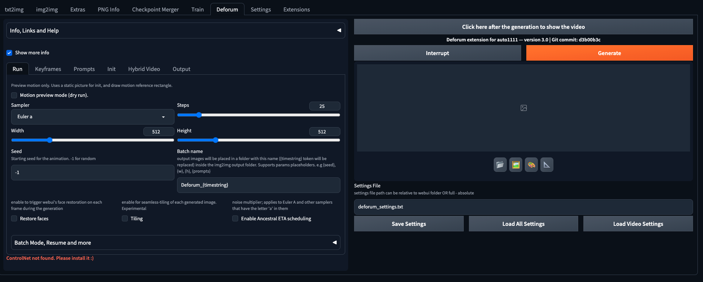

# unimaker-backend
unimaker backend 코드입니다.

이 코드는 AUTOMATIC1111/stable-diffusion-webui 1.6.0 버전을 기준으로 작성되었습니다.

이 코드는 unimaker의 backend api 구현을 위해서 deforum 코드에서 api 부분만 수정한 코드입니다.

## 시작하기
1. 먼저, A1111의 stable diffusion webui를 설치합니다.

[stable-diffusion-webui](https://github.com/AUTOMATIC1111/stable-diffusion-webui)

2. 이 코드를 stable-diffusion-webui의 extension에 설치합니다. 두 가지 방법이 있습니다:

   1) 터미널에서 extension folder에서 다음 명령어를 입력합니다.
   ``` bash
   git clone https://github.com/DCV1/unimaker-backend.git
   ```

   2) 또는 이 repo를 다운로드하고, webui가 설치된 경로의 extension 폴더 안에 deforum이라는 폴더를 새로 만들고, 다운받은 파일을 거기에 붙여넣습니다.

### xformers
- xformer를 설치하면 이미지 생성을 더 빨리 할 수 있습니다.
- xformer를 설치하는 방법은 간단하다. webui.sh를 실행할 때 "—xformers"를 추가하면 간단하게 설치가 됩니다.
``` bash
bash webui.sh --xformers
```

deforum에는 이 밖에 다양한 argument를 넣을 수 있는데, arguments에 대한 정보는 다음 링크에서 볼 수 있습니다.
[deforum-arguments](https://github.com/AUTOMATIC1111/stable-diffusion-webui/wiki/Command-Line-Arguments-and-Settings)

절차를 따라서 설치를 완료하면 다음과 같은 화면을 볼 수 있습니다.

하단에 보면 controlnet을 설치하라는 문구를 볼 수 있는데, 이것도 해당 글씨를 눌러서 설치해주면 됩니다.

## 실행하기

deforum api를 실행시키고 싶을 때는 webui를 킬 때 다음과 같이 입력하면 됩니다.
``` bash
bash webui.sh --deforum-api --xformers
```

## 코드 출처
[deforum-webui](https://github.com/deforum-art/sd-webui-deforum)

